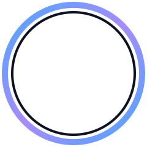
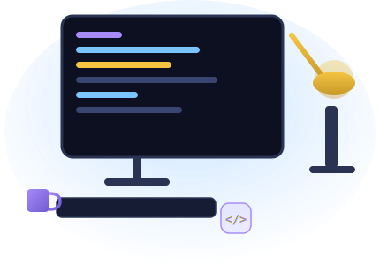

 

&nbsp;&nbsp;Hi there, I'm

# &nbsp;&nbsp;Abdulqadoos Al&#8209;Shibani

&nbsp;&nbsp;

&nbsp;&nbsp;

 
 

> I build **beautiful, fast** and **scalable** apps with clean code and modern technologies.

 

## 🖥️ About Me

I'm a passionate **Flutter Developer** and **Web Developer** who loves turning ideas into real-world, production-ready digital products. I focus on writing clean, maintainable code and building smooth, pixel-perfect user experiences — with a strong specialization in **Arabic-first, RTL-ready** applications.

- 📱 Building cross-platform mobile apps with Flutter
- 🌐 Creating responsive, bilingual (AR/EN) web applications
- 🔥 Firebase architecture & offline-first data patterns
- 🎯 Focused on performance, UI/UX and scalability
- 📚 Always learning and exploring new technologies

 

## 🛠️ Tech Stack

**Mobile**
 

**Frontend**
 

**Backend & Database**
 

**Tools**
 

 

## 📊 GitHub Stats

  

 

## 📅 Contribution Activity

 

## 🚀 Featured Projects

⚠️ ما زلت أملك مستودعين فقط قابلين للعرض حاليًا. ارفع "سوقة" و"ShaibAI" و"ذِمّة" كمستودعات Public على GitHub وأرسل لي أسماءها لأضيف بطاقاتها هنا.

 

## 📫 Let's Connect

 

© 2026 Abdulqadoos Al-Shibani

